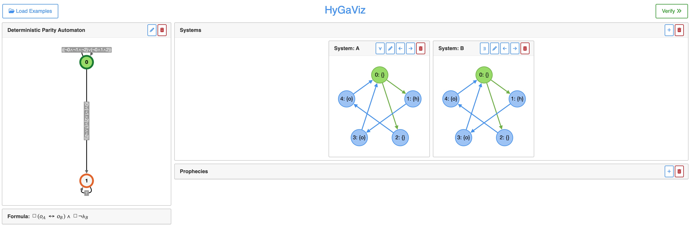
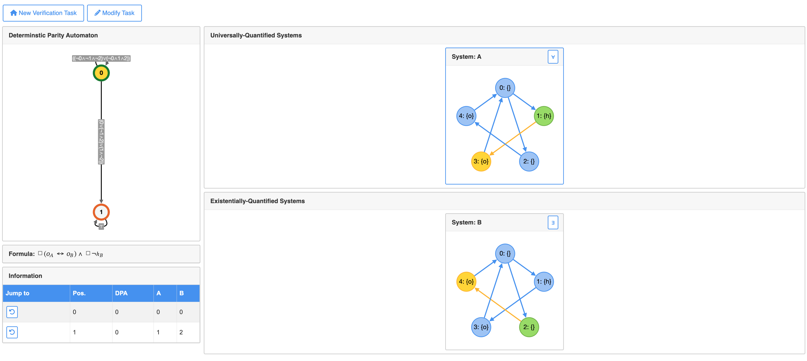

# HyGaViz: Visualizing Game-Based Certificates for Hyperproperty Verification

This repository contains HyGaViz - a verification and visualization tool for hyperproperties specified in HyperLTL.
Clone this repository and **initialize all submodules** by running

```shell
git clone https://github.com/reactive-systems/HyGaViz
cd HyGaViz
git submodule init
git submodule update
```

## Overview
HyGaViz supports the exploration of certificates for the satisfaction of $\forall^*\exists^*$ HyperLTL formulas. 
On the initial page (see below), the user can add (possibly different) finite state transition systems, and define the LTL body of the HyperLTL formula. 
Note how the name, the order, and the quantification type of the system implicitly define the quantifier prefix of the HyperLTL formula. 
The buttons above each system, allow the user to change the quantification type, change the system (via a text-based format), change the order of the systems, and remove the system. 
The LTL body is converted to a deterministic parity automaton (DPA) displayed on the top left.



Upon clicking the ``Verify'' button, HyGaViz attempts to generate a strategy that proves the satisfaction of the HyperLTL formula. 
If a strategy is found, the user is directed to the visualization page (see below). 
Here, HyGaViz marks the current state of each system -- separated into user-controlled universally quantified systems (top right) and strategy-controlled existentially quantified ones (bottom right) -- and displays the current state of the DPA (top left) (in green).
The user takes the role of the $\forall$-player and, in each step, determines successor states for all universally quantified executions. 
Once successor states for all universally quantified systems are confirmed (by _clicking_), HyGaViz automatically updates existentially quantified systems (and the DPA state), based on the internally computed strategy. 
Moreover, HyGaViz highlights the next states (in yellow) when the user _hovers_ over possible successor states for the universally quantified systems. 
Using the information tab in the bottom left, the user can jump to previous situations and explore the reaction of the strategy to different choices for the universally quantified system.



## Structure 

HyGaViz consists of a verification backend and a browser-based front end. 
This repository is structured as follows:

- `backend/` contains the backend (written in F#). 
    * `backend/src` contains the source code of HyGaViz
    * `backend/app` is the target folder for the backend build. The final HyGaViz backend executable will be placed here.
    * `backend/examples` contains some example JSON inputs
- `frontend/` contains the frontend (written in JavaScript)


## Build HyGaViz Backend

This section contains instructions on how to build and run HyGaViz.

### Dependencies

To build and run HyGaViz, you need the following dependencies:

- [.NET 8 SDK](https://dotnet.microsoft.com/en-us/download) (tested with version 8.0.204)
- [spot](https://spot.lrde.epita.fr/) (tested with version 2.11.6)
- [oink](https://github.com/trolando/oink) 
- [Node.js](https://nodejs.org/en) (tested with version 21.7.3)

Install the .NET 8 SDK (see [here](https://dotnet.microsoft.com/en-us/download) for details) and Node.js (see [here](https://nodejs.org/en/download) for details).
Download and build _spot_ (details can be found [here](https://spot.lrde.epita.fr/)). 
Clone and build _oink_ (details can be found [here](https://github.com/trolando/oink)). 
You can place the _spot_ and _oink_ executables in any location of your choosing, and provide HyGaViz with the _absolute_ path (see details below).

### Build HyGaViz

To build HyGaViz run the following (when in the main directory of this repository).

```shell
cd backend/src/HyGaViz
dotnet build -c "release" -o ../../app
cd ../../..
```

Afterward, the `HyGaViz` executable is located in the `backend/app/` folder.

### Connect Spot and Oink

HyGaViz requires the _ltl2tgba_ and _autfilt_ executable from the spot library and the _oink_ parity game solver.
HyGaViz is designed such that it only needs the **absolute** path to these executables, so they can be installed and placed at whatever location fits best.
The absolute paths are specified in a `paths.json` configuration file. 
This file must be located in the *same* directory as the HyGaViz executables (this convention makes it easy to find the config file, independent of the relative path HyGaViz is called from). 
We provide a template file `backend/app/paths.json` that **needs to be modified**. 
After having built _spot_ and _oink_, paste the absolute path to _spot_'s _ltl2tgba_ and _autfilt_ executables and the _oink_ executable to the `paths.json` file. 
For example, if `/usr/bin/ltl2tgba`, `/usr/bin/autfilt`, and `/usr/oink/build/oink` are the _ltl2tgba_, _autfilt_, and _oink_ executables, respectively, the content of `backend/app/paths.json` should be

```json
{
    "ltl2tgba": "/usr/bin/ltl2tgba", 
    "autfilt": "/usr/bin/autfilt", 
    "oink": "/usr/oink/build/oink"
}
```


### Test Connection

To test that the HyGaViz backend has been set up correctly, we provide a few test cases. 
The following three commands, test the three basic functions performed by the back-end, and should each print a JSON string.  

```
backend/app/HyGaViz --parse-ts backend/examples/ts1.txt
```

```
backend/app/HyGaViz --translate-ltl backend/examples/ltl1.txt
```

```
backend/app/HyGaViz --verify backend/examples/ver1.txt
```


## Build HyGaViz FrontEnd

HyGaViz's frontend consists of a REST API written in Node.JS and a HTML/JavaScript. 
The Node.js server uses the back end (located in `backend/app/HyGaViz`) for strategy synthesis. 
After the backend has been built, you can start install the dependencies of the frontend by running 

```shell
cd frontend 
npm install 
cd ..
```


## Run HyGaViz

After the backend and frontend have been set up, you can start HyGaViz by running

```shell
cd frontend 
npm start
```

The server will continue to run until it is stopped. 
You can visit HyGaViz's frontend at [http://localhost:8383](http://localhost:8383) to see the website.
After you are done, exit the server by running `CTRL C`.


## Using HyGaViz

